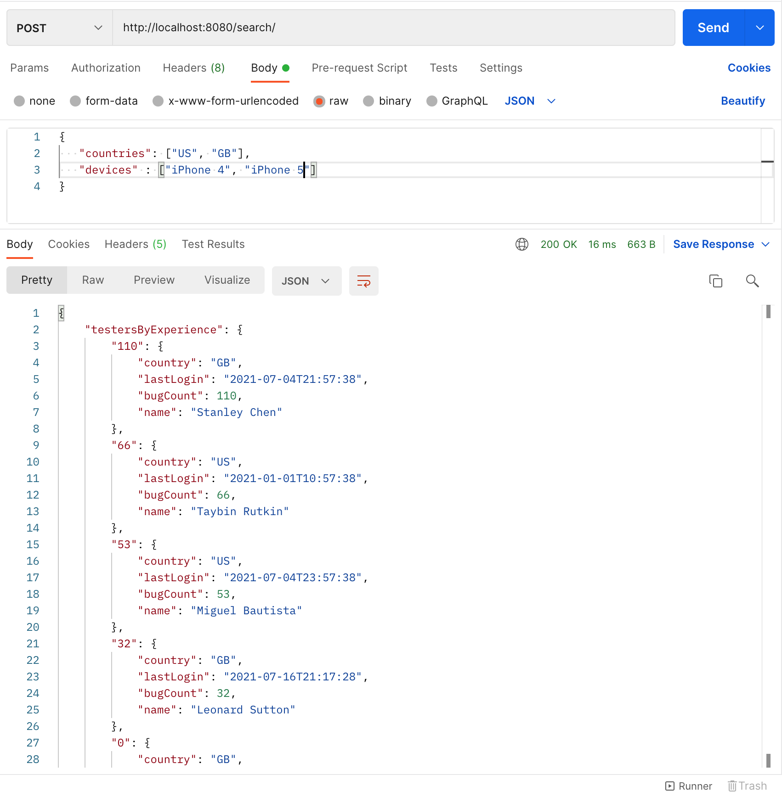

# Tester

This project is an example of a web service created with Spring Boot.  
It will retrieve a set of Testers based on the countries and devices specified.
They will be shown in order of how many bugs they have found (experience).

To start the server, run the following command in a terminal window in the main directory:

`./gradlew bootRun`

The data is loaded from CSV files into an H2 database upon start up.

Requests are to be made as a POST request to the endpoint at:

http://localhost:8080/search/

JSON should be sent containing values for countries.  The options are:
1. US
2. GB
3. JP
4. ALL (just use this one if requesting all countries)

The choices for devices are:
1. iPhone 4
2. iPhone 4S
3. iPhone 5
4. Galaxy S3
5. Galaxy S4
6. Nexus 4
7. Droid Razor
8. Droid DNA
9. HTC One
10. iPhone 3
11. ALL (if using this one, it should be the only device value)

The body of the request should look like this:

`
{
    "countries": ["US", "GB"],
    "devices" : ["iPhone 4", "iPhone 5"]
}`

or 

`
{
"countries": ["ALL"],
"devices" : ["iPhone 4", "Droid DNA"]
}`

You can use Postman or something similar to test this.

